# UnlockED Screenshots

This directory contains comprehensive visual documentation of all application features in both light and dark modes, across desktop and mobile viewports.

## Directory Structure

- `light/` - Desktop screenshots in light mode
- `dark/` - Desktop screenshots in dark mode  
- `mobile-light/` - Mobile screenshots in light mode
- `mobile-dark/` - Mobile screenshots in dark mode

## Overview

These screenshots demonstrate the complete UnlockED user experience, including:

### 🏠 Core Pages
- Homepage with hero section and featured courses
- Course directory with advanced filtering
- Individual course detail pages (randomly selected)
- User authentication flows

### 🎯 Interactive Features  
- Filter panel functionality (desktop & mobile)
- Skill-based course filtering
- Search functionality
- Expandable course cards
- Theme switching (light/dark mode)

### 📱 Responsive Design
- Mobile navigation menus
- Responsive filter panels
- Touch-friendly interfaces
- Adaptive layouts

## Screenshots


### Homepage
*Homepage with hero section and features*

| Desktop Light | Desktop Dark | Mobile Light | Mobile Dark |
|---------------|--------------|--------------|-------------|
|  |  |  |  |


### Courses Directory
*Course directory with all courses visible*

| Desktop Light | Desktop Dark | Mobile Light | Mobile Dark |
|---------------|--------------|--------------|-------------|
|  |  |  |  |


### Courses With Filters
*Course directory with filters panel visible*

| Desktop Light | Desktop Dark | Mobile Light | Mobile Dark |
|---------------|--------------|--------------|-------------|
|  |  |  |  |


### Courses Without Filters
*Course directory with filters panel hidden*

| Desktop Light | Desktop Dark | Mobile Light | Mobile Dark |
|---------------|--------------|--------------|-------------|
| 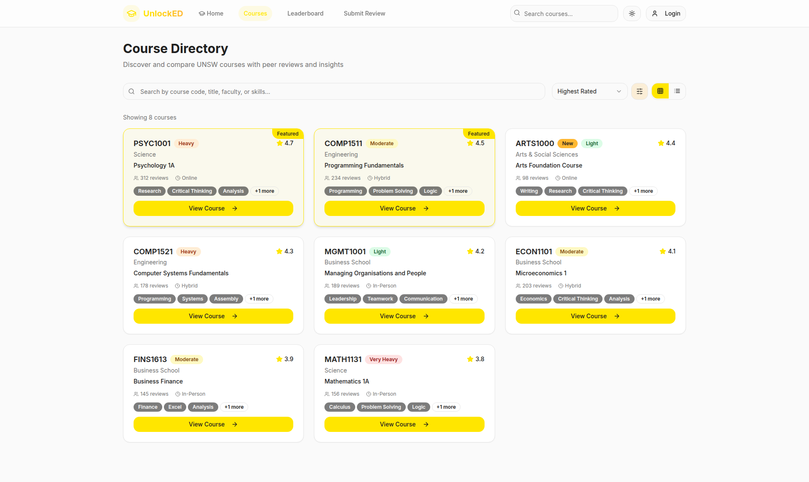 | 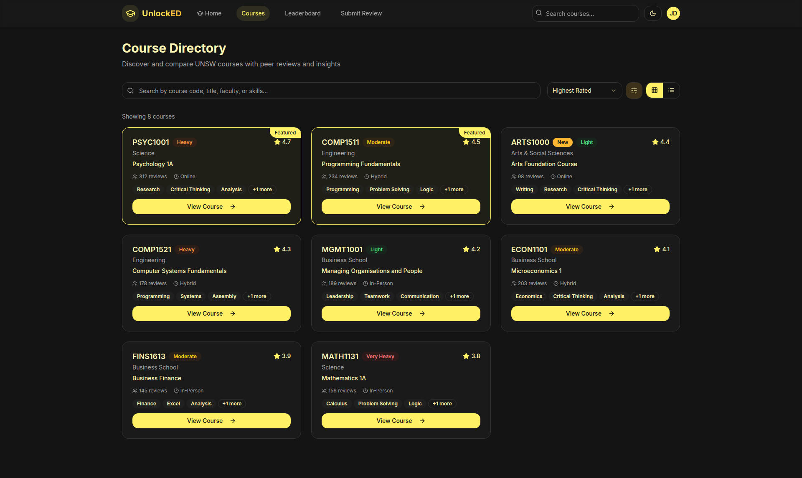 |  | 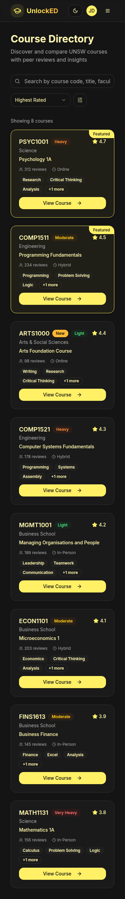 |


### Mobile Filters Open
*Mobile filter panel opened*

| Desktop Light | Desktop Dark | Mobile Light | Mobile Dark |
|---------------|--------------|--------------|-------------|
| 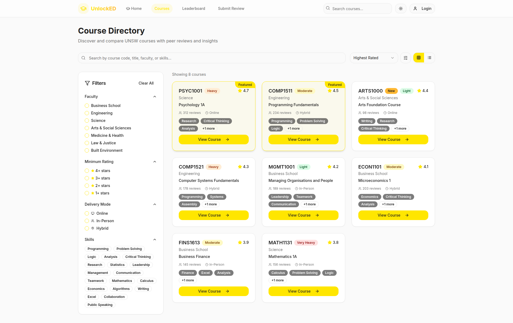 | 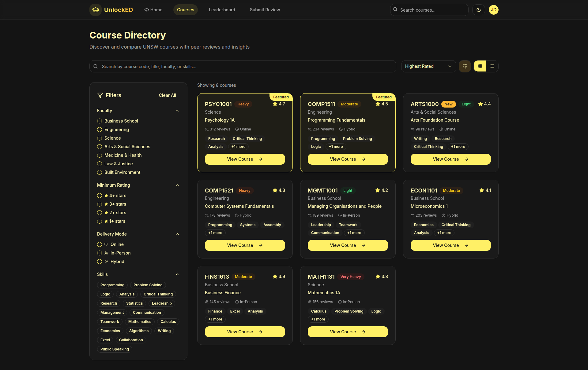 | 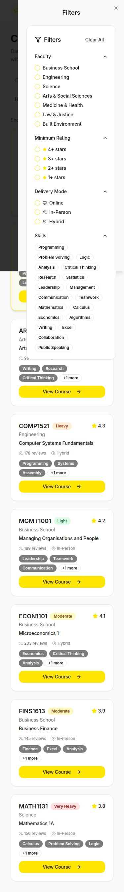 | 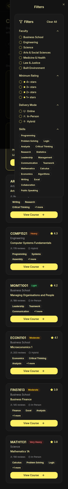 |


### Courses Filtered By Skills
*Courses filtered by Programming skill*

| Desktop Light | Desktop Dark | Mobile Light | Mobile Dark |
|---------------|--------------|--------------|-------------|
|  |  |  |  |


### Courses Search Active
*Course search functionality*

| Desktop Light | Desktop Dark | Mobile Light | Mobile Dark |
|---------------|--------------|--------------|-------------|
|  |  |  |  |


### Course Card Expanded Skills
*Course card with expanded skills*

| Desktop Light | Desktop Dark | Mobile Light | Mobile Dark |
|---------------|--------------|--------------|-------------|
|  |  |  |  |


### Login Page
*Login/signup page*

| Desktop Light | Desktop Dark | Mobile Light | Mobile Dark |
|---------------|--------------|--------------|-------------|
|  |  |  |  |


### Login Signup Tab
*Signup tab on login page*

| Desktop Light | Desktop Dark | Mobile Light | Mobile Dark |
|---------------|--------------|--------------|-------------|
|  |  |  |  |


### Login With Demo Credentials
*Login form filled with demo credentials*

| Desktop Light | Desktop Dark | Mobile Light | Mobile Dark |
|---------------|--------------|--------------|-------------|
|  |  |  |  |


### Authenticated Header
*Header with authenticated user dropdown*

| Desktop Light | Desktop Dark | Mobile Light | Mobile Dark |
|---------------|--------------|--------------|-------------|
|  |  |  |  |


### Leaderboard
*Leaderboard page*

| Desktop Light | Desktop Dark | Mobile Light | Mobile Dark |
|---------------|--------------|--------------|-------------|
|  |  |  |  |


### Submit Review
*Submit review page*

| Desktop Light | Desktop Dark | Mobile Light | Mobile Dark |
|---------------|--------------|--------------|-------------|
|  |  |  |  |


### Mobile Navigation
*Mobile navigation menu open*

| Desktop Light | Desktop Dark | Mobile Light | Mobile Dark |
|---------------|--------------|--------------|-------------|
| 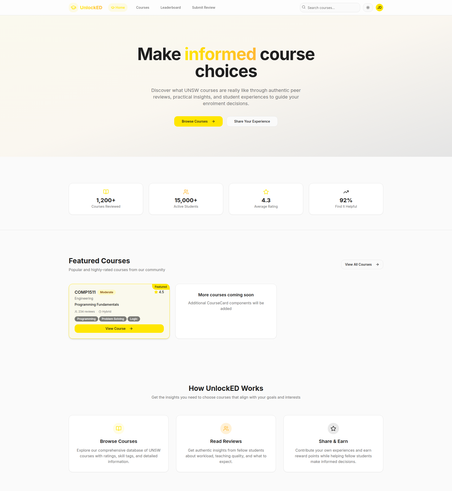 | 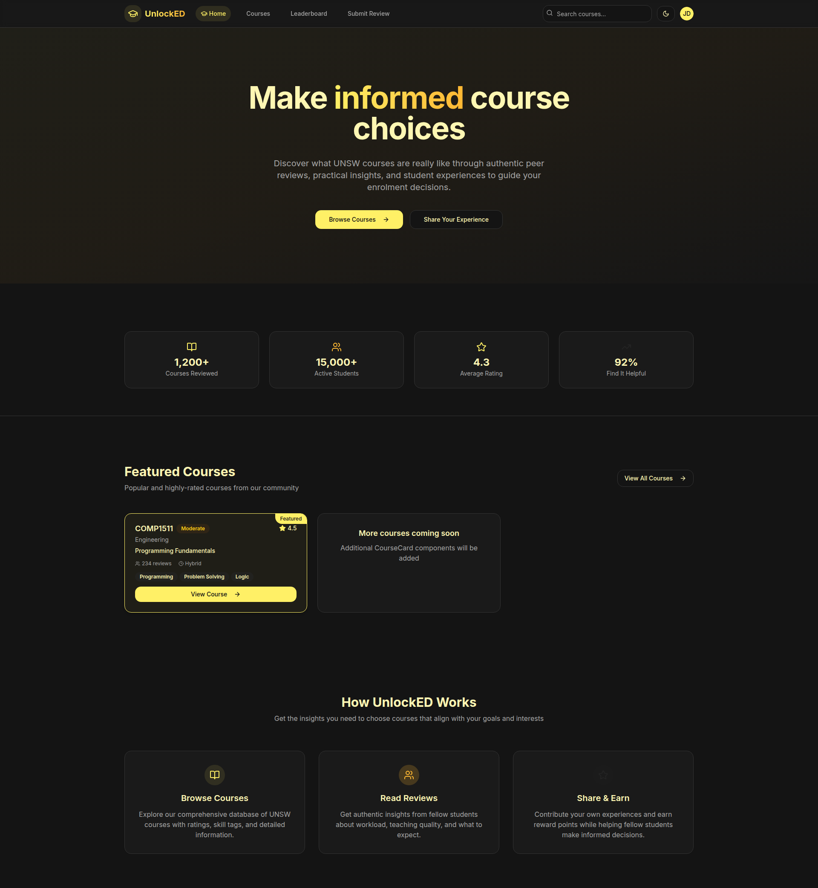 | 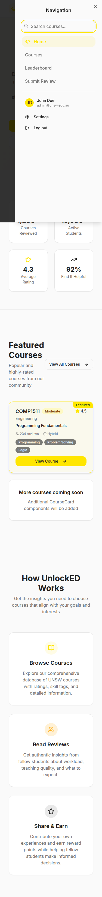 | 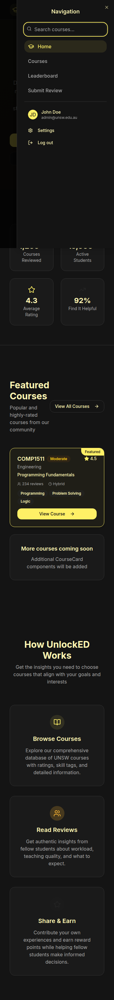 |


## Usage & Applications

These screenshots can be used for:

### 📚 Documentation
- README files and project documentation
- Feature specification documents
- User guide creation
- Technical documentation

### 🎨 Design & Development
- Design reviews and feedback sessions
- UI/UX consistency checks
- Cross-browser testing reference
- Responsive design validation

### 📢 Marketing & Communication
- Project showcases and portfolios
- Client presentations
- Social media content
- Grant applications and reports

### 🐛 Development Support
- Bug reports with visual context
- Feature request documentation
- Quality assurance testing
- User acceptance testing

### 🎓 Educational Resources
- Student project examples
- Course material supplements
- Tutorial creation
- Learning pathway documentation

## Regeneration

To update these screenshots with the latest application state:

```bash
# Ensure development server is running on localhost:8080
npm run dev

# In a new terminal, run the screenshot script
node take-all-pics.js
```

**Note**: The script randomly selects courses for detail page screenshots, so each run may show different courses (e.g., MGMT1001, PSYC1001, COMP1511, etc.).

---

**Generated on**: 2025-07-25T08:45:10.893Z  
**Application**: UnlockED - UNSW Course Companion  
**Repository**: [UnlockED GitHub](https://github.com/luci582/UnlockED)
